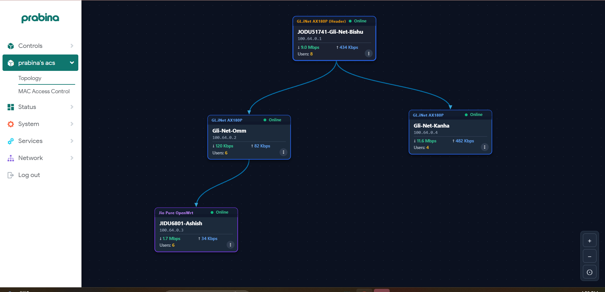
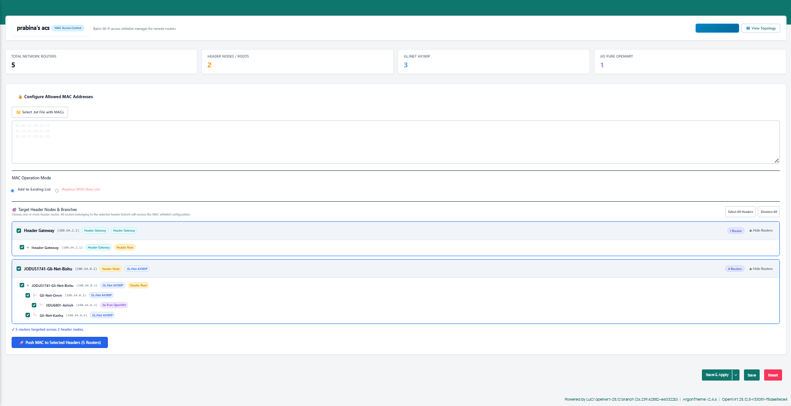

# Prabina's ACS

Prabina's ACS is a simple network management page for OpenWrt. It lets you see your routers in one place, create a network topology, check basic live information, and manage allowed MAC addresses on connected routers.

The application runs directly on your main OpenWrt router and communicates with other remote routers through Tailscale.

---

## How It Works

```text
Main OpenWrt Router
        ↓
  Prabina's ACS
        ↓
    Tailscale
        ↓
Other OpenWrt Routers
```

The main router acts as the central controller. It connects to your other routers over Tailscale SSH to read real-time status and push wireless settings without needing an external cloud server.

---

## Main Benefits

- **Visual Network Topology**: View and arrange your routers on an interactive map.
- **Live Router Stats**: Monitor online status, current download/upload speeds, and connected users.
- **Central Management**: Control multiple routers from one central interface instead of logging into each router separately.
- **Easy Web UI Access**: Open any connected router's web interface with a single click.
- **Batch MAC Filtering**: Update allowed Wi-Fi MAC addresses across multiple routers at once.
- **Tailscale Integration**: Securely communicates across locations using Tailscale IP addresses.
- **Save Layout**: Save your custom router positions so your topology stays organized.

---

## Supported Routers

- **GL.iNet AX180P** (uses GL.iNet's native MAC filter system)
- **Jio Pure OpenWrt routers** (uses standard OpenWrt wireless configuration)

Prabina's ACS automatically uses the correct MAC filtering method for each router type.

---

## Topology View



The topology view lets you arrange your routers visually and see their basic status in one place. You can drag nodes, connect child routers to parent routers, and monitor live speeds and client counts.

---

## MAC Access Control



Upload a text file containing MAC addresses or paste them in, choose which header branches to update, and apply them from one place. You can choose to add new MACs to the existing list or replace the list entirely.

---

## Basic Usage

1. Open Prabina's ACS in LuCI.
2. Add your routers using their Tailscale IP and SSH details.
3. Choose the router type (GL.iNet or Jio Pure OpenWrt).
4. Arrange the routers in the topology.
5. Click **Save Topology**.
6. Open **MAC Access Control** whenever you need to update allowed Wi-Fi devices.

---

## Install

SSH into your main OpenWrt router and run:

```sh
wget -qO- https://raw.githubusercontent.com/dev-prabina/networking/main/prabina%27s%20acs/install.sh | sh
```

The installer adds Prabina's ACS to LuCI and installs only the files required by ACS.

---

## Uninstall

SSH into your router and run:

```sh
sh /usr/bin/prabina-acs-uninstall
```

This removes only Prabina's ACS. It does not remove Tailscale, LuCI, OpenWrt, existing router settings, or other custom interfaces.

---

## Lightweight & Safe Design

- **Lightweight**: ACS is designed to run directly on an OpenWrt router without needing a separate server or high RAM/CPU usage.
- **Safe Separation**: Prabina's ACS is built as a separate LuCI application. It will not modify your existing router features or network settings unless you explicitly request an action.
